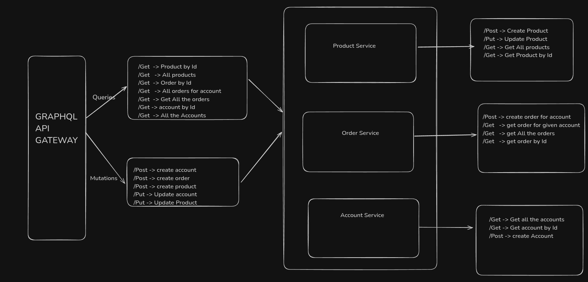

# Microservices Monorepo (WIP)

This repository contains a monorepo architecture for a microservices-based application written in Go. It is currently **under development** and aims to be a scalable and modular foundation for backend systems.

## 🚧 Status: Work In Progress

This project is actively being built. Expect breaking changes, incomplete features, and evolving architecture.

## 🚧 Architecture

---

## 📦 Structure

```
micro-services/
├── account/           # Account service
│   ├── cmd/           # CLI entrypoints
│   ├── db/            # SQLC config and DB Dockerfile
│   ├── client.go      # Service-to-service or external API client
│   ├── server.go      # Server setup and routing
│   └── service.go     # Business logic
├── order/             # (Coming soon)
├── product/           # (Coming soon)
├── graphql/           # GraphQL schema and resolvers
│   ├── account_resolver.go
│   ├── app.dockerfile
│   ├── generated.go
│   ├── gqlgen.yml
│   ├── graph.go
│   ├── main.go
│   ├── models_gen.go
│   ├── models.go
│   ├── mutation_resolver.go
│   └── query_resolver.go
├── docker-compose.yml # Container orchestration
├── go.mod
└── go.sum
```

Each service is designed to be self-contained with its own:

- `db/` folder for SQL migrations and sqlc configs
- `graphql/` schema and resolvers using gqlgen
- Business logic in `service.go`

## 🛠 Tech Stack

- **Go** – primary language
- **GraphQL (gqlgen)** – API layer
- **sqlc** – type-safe SQL database access
- **Docker** – containerization of services
- **PostgreSQL** – database (via docker-compose)

## 📌 Key Features (Planned)

- Modular service-based architecture
- GraphQL APIs for all services
- Type-safe DB access with raw SQL
- Dockerized development environment
- CI/CD and observability integrations (future)

## 🚀 Getting Started

1. **Clone the repo:**
   ```bash
   git clone https://github.com/KaranMali2001/Golang-micro-services.git
   cd Golang-micro-services
   ```
2. **Start services:**
   ```bash
   docker-compose up --build
   ```
3. **Run Go services manually (dev):**
   ```bash
   go run account/main.go
   ```

## 💡 Vision

This project is an experimental platform for building robust, maintainable backend services in Go. Eventually, this will become a scalable foundation for real-world backend infrastructure.

---

## 📬 Contact

If you're interested in collaborating or have feedback, feel free to reach out or create an issue.
